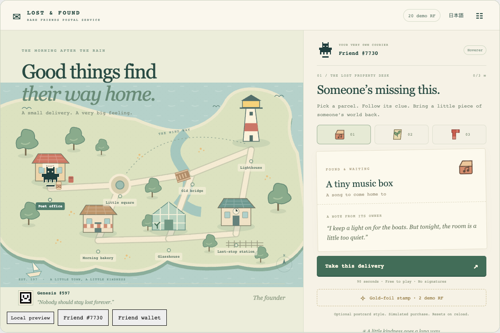

# Rare Friends: Lost & Found

**A small delivery. A very big feeling.**

A playable Vibeathon prototype by the holder of Genesis #597. Your verified Generations Friend becomes a courier in a rain-washed harbour town. Solve three delivery clues, take connected streets or a timed wind shortcut, and keep a personalised 1200 × 800 PNG postcard.



## Play locally

```sh
npm ci
npm run build
node scripts/dev-game.mjs dev games/lost-and-found --port 4173
```

Open http://127.0.0.1:4173 in a browser with a wallet. The official SDK verifies ownership of a hardwired Generations NFT (Gen 1+) on Robinhood mainnet. Genesis #597 is the founder portrait, not a replacement for the playable Generations requirement. The build contains no test wallet or identity bypass. No signatures or funding are needed.

The captured screenshots use a read-only **automated test fixture, Friend #7730**. They do not assert that the builder owns #7730. Genesis #597 art is the real on-chain portrait supplied in the user's request.

## Implemented

- Three complete, free 90-second deliveries with English/Japanese UI and original stories.
- Click/touch street navigation; keyboard access using Tab and Enter. A 2.5-second cost per street, 8-second wrong-address penalty, optional skill shortcut.
- Original SVG harbour map and selected NFT's canonical artwork.
- Locally rendered postcard PNG with the actual courier ID, destination, rating and optional gold-foil stamp. Save through the browser image context menu or a screenshot; sharing is manual.
- A single 2 demo RF cosmetic purchase, confirmed by the official SDK. No live transactions, random prizes, redemption or burn.
- Sound toggle, reduced motion, hidden-tab and menu pause, loading/error/retry states, dialog focus management.

## Validation

```sh
npm run build
npm run typecheck
npx tsc -p games/lost-and-found/tsconfig.json
node --experimental-strip-types --test --experimental-test-coverage --test-coverage-include='**/games/lost-and-found/model.ts' --test-coverage-lines=80 --test-coverage-functions=80 games/lost-and-found/model.test.mjs
node scripts/dev-game.mjs check games/lost-and-found
npx playwright install chromium
node games/lost-and-found/browser.test.mjs
```

The browser suite can use an already-installed Chromium through the optional `LOST_FOUND_CHROMIUM` environment variable. This only changes automated tests. See [validation record](games/lost-and-found/VALIDATION.md).

## Submission status

The [public preview](https://horusuzu.github.io/rare-friends-lost-and-found/) and [source repository](https://github.com/horusuzu/rare-friends-lost-and-found) are being published. The English [submission](submissions/lost-and-found/README.md) is prepared but not yet filed, pending the requested real-wallet playtest. Real connected-wallet play with the builder's eligible Generations NFT remains to be checked. No Genesis ownership is inferred from holding the test fixture.

See [game rules and asset credits](games/lost-and-found/README.md). The original SDK instructions remain in [README.md](README.md), [API.md](API.md) and [AGENTS.md](AGENTS.md).
